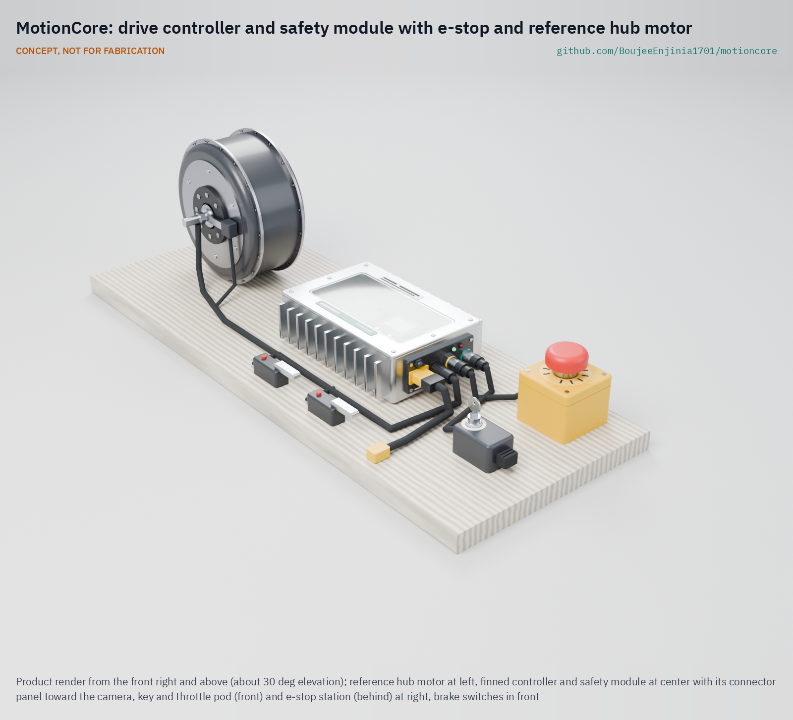

# MotionCore

     

**Area:** Shared Components · **TRL:** 3 of 9 (proof of concept on paper) · **Prototype budget:** about $300 USD · **Difficulty:** 4 of 5

A standard controller and safety module (open motor controller, e-stop, speed limit and brake interlock) with a named reference hub motor, which the lab's mobility and automation designs bolt on rather than re-engineer.

[Exploded render](media/render-exploded.png) · [Detail render](media/render-detail.png) · [Interactive 3D model](media/viewer.html) · [Concept blueprint (PDF)](media/concept-blueprint.pdf) · [General arrangement MTC-DWG-001 (PDF)](cad/drawings/MTC-DWG-001.pdf) · [Sizing note MTC-CAL-001](docs/04-calcs/01-sizing.md) · [Review note](docs/REVIEW.md)

## Concept rationale

Standardizing the drive and safety chain lets the lab spend design effort on what is different about each vehicle, while every project inherits a reviewed safety function. MotionCore pairs an open VESC-class controller with a small independent supervisor and a DC contactor: the controller does the motor control it is already good at, and the supervisor and a hardwired emergency stop loop provide the second channel that low-cost controllers lack.

Keeping it open and garage-buildable matters because the people most likely to build small electric machines are makers, students and small workshops. Every part is sold off the shelf, the safety loop can be checked with a multimeter, and the interface is documented so that a host project, or anyone else, can reuse the module without closed tools.

## Burning platform

Light electric vehicles and small machines are spreading faster than the engineering support behind them. Almost 10 million electric two-wheelers were sold worldwide in 2025, about 14 % of all two-wheeler sales ([IEA Global EV Outlook 2026](https://www.iea.org/reports/global-ev-outlook-2026/trends-in-other-ev-modes)). In the United States, the Consumer Product Safety Commission estimates about 698,500 emergency department visits linked to micromobility products from 2017 through 2024 and records 533 deaths ([CPSC](https://www.cpsc.gov/s3fs-public/Micromobility_Products-Related_Deaths_Injuries_and_Hazard_Patterns_2017-2024.pdf)); most are crashes, which show how many people now ride and work beside small electric drives.

In workplaces, moving vehicles and machinery remain leading causes of death. In Great Britain, 24 of the 126 workers killed in 2025/26 were struck by a moving vehicle and 10 died in contact with moving machinery (provisional figures, [HSE](https://www.hse.gov.uk/STATISTICS/fatals-overview.htm)). An emergency stop that works without software, a speed limit that does not depend on one controller and a drive that never restarts by itself are basic protections, yet small builds often skip them.

## Where it could be used

### By industry

| Industry | Use |
| --- | --- |
| Warehousing and logistics | Drive and stop chain for powered pallet jacks, carts and tugs at walking pace (as in PalletPilot) |
| Last-mile delivery | Assist drives for cargo trailers, cargo bikes and stair-climbing hand trucks (CargoMule, StepClimber) |
| Agriculture | Small electric field carts, orchard platforms and barrows with a reliable stop |
| Solar operations and maintenance | Panel-cleaning robots and equipment carts on solar farms |
| Education and makerspaces | Teaching safe drive design with an open, inspectable safety loop |
| Rural transport | Bicycle conversion kits and shared-pack vehicles (SunSpoke with SwapCell) |

### By country or region

| Country or region | Why it matters there |
| --- | --- |
| United States | Micromobility injuries are tracked closely and rising; CPSC records 310 e-bike deaths from 2017 through 2024 ([CPSC](https://www.cpsc.gov/s3fs-public/Micromobility_Products-Related_Deaths_Injuries_and_Hazard_Patterns_2017-2024.pdf)) |
| European Union | Pedal-assist up to 250 W with a 25 km/h cutoff is excluded from type approval ([Regulation (EU) No 168/2013](https://eur-lex.europa.eu/legal-content/EN/TXT/PDF/?uri=CELEX%3A32013R0168)), so an independent speed limit matters for small builders |
| China | More than 7 million electric two-wheelers sold in 2025, over 55 % of the market ([IEA](https://www.iea.org/reports/global-ev-outlook-2026/trends-in-other-ev-modes)) |
| India | Almost 800,000 electric three-wheelers sold in 2025, almost 70 % of three-wheeler sales, many built and serviced by small workshops ([IEA](https://www.iea.org/reports/global-ev-outlook-2026/trends-in-other-ev-modes)) |
| Vietnam | About 735,000 electric two-wheelers sold in 2025, more than 20 % of the market ([IEA](https://www.iea.org/reports/global-ev-outlook-2026/trends-in-other-ev-modes)) |
| Kenya | Electric two-wheeler sales more than tripled in 2025 to over 25,000, around 15 % of new two-wheeler registrations, driven by motorcycle taxi riders ([IEA](https://www.iea.org/reports/global-ev-outlook-2026/trends-in-other-ev-modes)) |

## What sparked the idea

The idea traces back to a 2006 recall. The U.S. Consumer Product Safety Commission and Segway recalled about 23,500 Segway personal transporters because the machine could unexpectedly apply reverse torque to its wheels and throw the rider; six injuries to heads and wrists were reported, and the fix was a software upgrade ([CPSC recall notice](https://www.cpsc.gov/Recalls/2006/segway-inc-announces-recall-to-repair-segway-personal-transporters)). The recall shows how the safety of a small electric vehicle can hinge on one controller's software. MotionCore starts from the opposite assumption: the controller may misbehave, so an emergency stop that needs no firmware, a speed check on a separate sensor and a brake interlock sit beside it, and every host that bolts the module on inherits them.

## Problem

Each vehicle or machine concept re-specifies the same drive train and safety logic, and small teams rarely have time to get the emergency stop, speed limit and brake interlock right.

## Concept

A standard controller and safety module (open motor controller, e-stop, speed limit and brake interlock) with a named reference hub motor, which the lab's mobility and automation designs bolt on rather than re-engineer.

A finned module, 243 x 168 x 66 mm, holds an open VESC-class controller, a safety supervisor, a DC contactor and a precharge and fuse block. The emergency stop opens the contactor through a hardwired loop that works without any firmware, the speed limit is checked twice (controller and supervisor, each with its own speed signal), and the drive never restarts until the operator resets it. It runs from 20 to 60 V packs (24, 36 and 48 V classes), including SwapCell and CellGuard-managed 16S LiFePO4, and reads SwapCell or CellGuard faults over CAN.

The TRL 3 sizing note (MTC-CAL-001) gives, on paper: 250 W continuous at 40 °C ambient with about 50 °C on the case; 350 W on 24 V packs at about 58.5 °C, close to the 60 °C limit (at risk); motor power removed within 67 ms of an e-stop in the worst case; and a MotionCore kit cost of $265 against the $300 budget, with the $70 reference motor costed to each host. The module weighs about 1.94 kg, inside its 2.0 kg limit. All figures are estimates, not measurements.

Full design precis: [docs/02-concept.md](docs/02-concept.md)

## Key components

- Reference 250 W geared hub motor, named in the interface and costed to each host (hosts may fit another motor within the rating)
- Open-source motor controller (VESC class, 20 to 60 V input)
- Safety supervisor board with its own speed sensor
- Hardwired twin-channel emergency stop and DC contactor, with precharge and main fuse
- Brake interlock switches
- Key switch and throttle pod (command input; CAN for host computers)
- Finned aluminum enclosure that doubles as the heat sink, on four M6 mounts
- Wiring harness with keyed connectors

The priced bill of materials is in [bom/bom.csv](bom/bom.csv); the parametric model is `cad/src/model.py`, with STEP and STL exports in `cad/step/` and `cad/stl/`.

## Safety

> Moving machinery and stored electrical energy: guard all rotating parts, test the emergency stop before every run and limit speed during development, with the wheel off the ground for first runs. The safety functions are unverified paper designs until tested. A category 0 stop removes drive power but does not brake, so every host needs brakes that work unpowered. Never bridge the safety loop. Bus capacitors hold charge after disconnection, and the enclosure can reach about 60 °C, more in direct sun. The main fuse must be rated for the full DC pack voltage. Lithium cells can overheat, vent and burn. Use protected cells or LiFePO4, fuse every pack, charge only within the cell maker's limits and never leave a first build charging unattended. MotionCore is a research prototype, not certified to any machinery or vehicle standard. See [docs/02-concept.md](docs/02-concept.md#safety).

## Repository layout

| Folder | Contents |
| --- | --- |
| `docs/` | Problem, concept, requirements, calculations and design decisions |
| `cad/src/` | build123d Python source, the source of truth for all geometry |
| `cad/step/`, `cad/stl/` | Exported models for FreeCAD, other CAD tools and printing |
| `cad/drawings/` | 2D sketches and dimensioned drawings |
| `bom/` | Bill of materials |
| `electronics/` | KiCad schematics and PCB layouts |
| `firmware/` | Microcontroller code |
| `media/` | Renders, perspectives and photos |
| `build-log/` | Dated prototyping notes |

## Documentation

Controlled documents follow the portfolio [documentation standard](.kit/STANDARDS.md). Each carries a document ID (MTC-PRC-001 for the precis), a version and a revision history. Branded PDFs are built with `python .kit/render.py` and attached to GitHub Releases when a document is tagged, for example `MTC-PRC-001/v1.0`.

## Credits

Designed by Amish Chadha. See [CONTRIBUTORS.md](CONTRIBUTORS.md) for roles. To cite this design, use [CITATION.cff](CITATION.cff) (GitHub shows it as "Cite this repository").

AI assistance (Claude) was used to accelerate concept renders, prototype documentation and first-pass sizing calculations. Design direction and all decisions are Amish Chadha's, recorded in this repository's decision records (`docs/decisions/`).

## Licenses

- **Hardware** (CAD, drawings, BOM, electronics): [CERN-OHL-S v2](LICENSE)
- **Software** (firmware, scripts, notebooks): [MIT](LICENSE-SOFTWARE)

A project of the [Design Molecule](https://designmolecule.com) lab.
