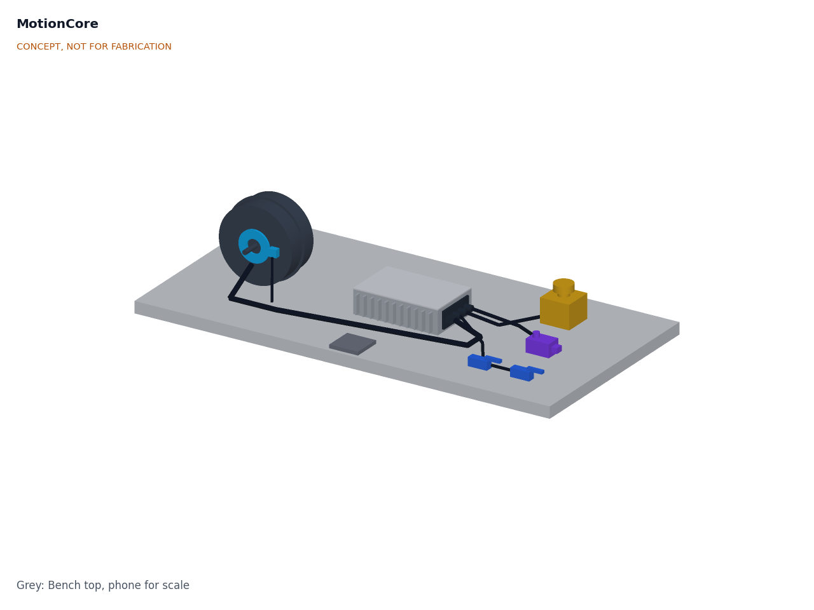
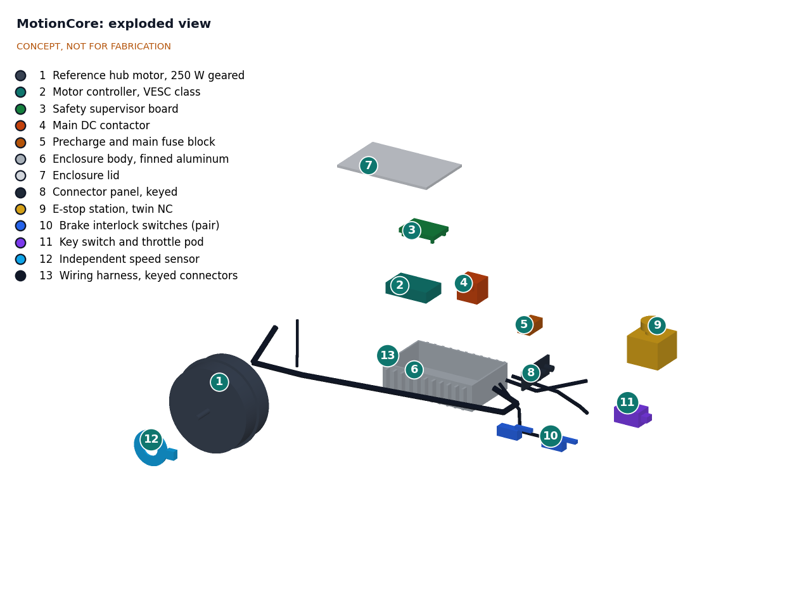
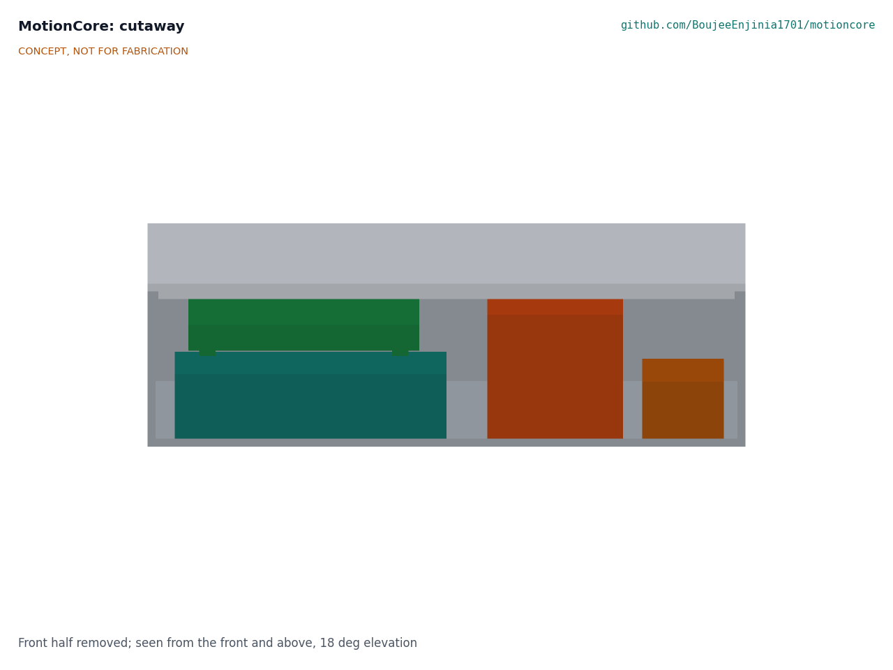
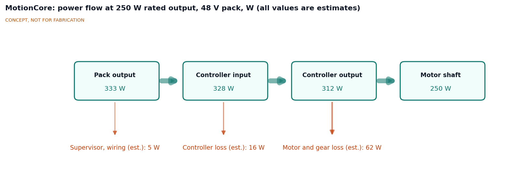

# MotionCore design precis

## Summary

MotionCore is a finned aluminum module, 243 x 168 x 66 mm, that sits between a host's battery pack and its motor. Inside are an open VESC-class motor controller, a small safety supervisor board, a DC contactor and a precharge and fuse block. Outside, one keyed connector panel links it to a named reference 250 W geared hub motor, a twin-channel emergency stop, two brake switches, a key and throttle pod and an independent speed sensor. The emergency stop opens the contactor through a hardwired loop, so it works even if both processors fail. The speed limit is held twice: once in the controller and once in the supervisor, which reads its own sensor.

The TRL 3 sizing note (MTC-CAL-001) gives, on paper: 6.9 A from a SwapCell pack in the reference case, about 50 °C on the case, motor power removed within 67 ms of an e-stop (worst case), and a MotionCore kit cost of $265 against the $300 budget, with the $70 reference motor costed to each host. The module weighs about 1.94 kg, inside the 2.0 kg limit Amish set in place of 1.5 kg (R12 met, 0.06 kg margin), and the 350 W heavy case on a 24 V pack runs close to the 60 °C case limit (R9 at risk). The design choices below were decided by Amish on 2026-09-25, going with the recommendations (MTC-DDR-001 and MTC-DDR-002).

*Figure 1. Reference kit laid out on a bench: module (center), reference hub motor (left), e-stop station, key and throttle pod and brake switches (right). Massing-plus model, not for fabrication.*

## How it works

1. **Power up.** The pack connects through an anti-spark plug and the main fuse. The supervisor, fed from the pack through its own 18 to 75 V buck, closes the precharge path, waits six time constants (0.6 s) and checks that the controller reports at least 90 % of the pack voltage; only then may the contactor close. On a SwapCell pack the supervisor first sends the SwapCell host heartbeat (host type 0, vehicle, mode 2).
2. **Enable.** The contactor coil is powered through the safety loop: e-stop channel A, the enable key and a supervisor-controlled switch, all in series. E-stop channel B goes to the supervisor as a separate input. The supervisor closes its switch only if the throttle reads zero, both brake switches are released, the controller reports no fault on CAN and the BMS reports no fault. This gives R4: no automatic restart.
3. **Drive.** The host's command (throttle, pedal-assist sensor or CAN set-point from a host computer) goes to the supervisor, which passes a limited command to the controller over an internal CAN bus. The controller runs the motor with its own current, temperature and speed limits. Its battery current limit is set to the lower of the host setting and the pack's allowed discharge current.
4. **Watch.** The supervisor times the pulses from a magnet ring on the wheel hub (item 12), independent of the controller's own speed estimate. It also watches the brake switches, command timeouts, temperatures and the BMS fault frames on the external CAN bus.
5. **Stop.** A brake switch or a minor fault sets the controller command to zero within 200 ms (R5, R7). Overspeed, a failed controller heartbeat or any safety-loop fault opens the contactor (stop category 0 in IEC 60204-1 terms). Pressing the e-stop opens the coil circuit directly, without software, and at the same time tells the supervisor to command zero current. A host with a spring-applied brake has that brake powered from the same loop, so it clamps when the loop opens.

*Figure 2. Exploded view. Numbers match `bom/bom.csv`.*

## Main components

*Table 1. Main components. Item numbers match the BOM and Figure 2.*

| Item | Component | Role |
| --- | --- | --- |
| 1 | Reference hub motor, 250 W geared | Named reference motor in the interface; costed to each host, which may substitute another motor within R2 |
| 2 | Motor controller, VESC class, 75 V stage | Field-oriented control, current and temperature limits, speed limit, CAN; overvoltage fault set to 66 V |
| 3 | Safety supervisor board | Microcontroller with two CAN buses, 18 to 75 V buck for the coil and logic, independent speed input, throttle, brake and e-stop channel B inputs, contactor enable switch, precharge switch, fault log |
| 4 | Main DC contactor, 100 A | Removes all power to the controller on e-stop or fault; coil in the safety loop; breaks at least 50 A at 60 V DC; releases within 50 ms with a 24 V Zener suppressor |
| 5 | Precharge and main fuse block | 100 Ω precharge resistor and switch; main fuse rated 60 V DC or more: 20 A for 36 and 48 V hosts, 40 A for 24 V hosts |
| 6 | Enclosure body, finned aluminum | Heat sink for the controller; four M6 mounting inserts on a 180 x 100 mm pattern |
| 7 | Enclosure lid | Gasketed cover |
| 8 | Connector panel, keyed | Power in, motor, safety loop and command connectors |
| 9 | E-stop station, twin NC | Red mushroom head on yellow, two normally closed contact blocks, twist release |
| 10 | Brake interlock switches (pair) | Normally closed switches on each brake lever or pedal |
| 11 | Key switch and throttle pod | Enable key (reset after a stop) and a hall-effect throttle |
| 12 | Independent speed sensor | Magnet ring and Hall pickup, read only by the supervisor |
| 13 | Wiring harness, keyed connectors | Pre-made leads from the panel to each device; 4 mm² pack leads for 24 V hosts |
| 14 | Isolation pads and consumables | Rubber pads on the host mounting points, standoffs, thermal pad |

*Figure 3. Cutaway through the module: supervisor board on standoffs above the controller (left), contactor (center) and precharge and fuse block (right).*

### Interface (MotionCore interface v0.1)

*Table 2. Connector set on the panel (item 8), from the +X end of the module. Decided by Amish, 2026-09-25 (MTC-DDR-001 item 6); the power connector is provisional until a sealed connector has been evaluated (MTC-DDR-002).*

| Connector | Type | Lines |
| --- | --- | --- |
| Power in | XT90 anti-spark plug (provisional, not sealed) | Pack positive and negative, 20 to 60 V |
| Motor | 9-pin waterproof e-bike motor plug | Three phases, Hall sensors, motor temperature |
| Safety loop | M12 8-pin A-coded | E-stop channels A and B, brake switches A and B, enable key, brake coil output |
| Command | M12 5-pin B-coded, so it cannot mate with the safety loop | Throttle or pedal-assist, CAN high and low (external bus, 250 kbit/s), 5 V, ground |

The module mounts on four M6 studs on a 180 x 100 mm pattern through rubber isolation pads (drawing MTC-DWG-001). The command connector carries the external CAN bus to a SwapCell pack or a CellGuard BMS; the controller sits on a separate internal bus. The SwapCell INTERLOCK coding resistor belongs in the host's pack receptacle, not in MotionCore.

## Numbers (MTC-CAL-001)

All numbers are paper estimates printed by `docs/04-calcs/sizing.py`; nothing is measured.

### Currents and fuse

At 250 W shaft power the pack supplies about 322 W: 6.9 A at 46.8 V (SwapCell) and 8.4 A at 38.4 V (CargoMule's 12S LiFePO4 pack). The heavy case, 350 W on 25.6 V, draws 17.7 A, and 22.9 A at 20 V. For 750 W over 10 s the pack delivers 21.9 A on SwapCell and 40.9 A on 8S LiFePO4. A 20 A fuse suits 36 and 48 V hosts and a 40 A fuse suits 24 V hosts, both rated for 60 V DC or more with at least 1 kA breaking capacity (prospective short-circuit currents are about 470 to 860 A for the three packs calculated; a CellGuard 16S pack is to be checked once its resistance is known). The 100 A contactor has a wide margin on continuous current; its selection criteria are breaking at least 50 A at 60 V DC and releasing within 50 ms.

*Figure 4. Estimated power flow at 250 W shaft output on a SwapCell pack (MTC-CAL-001).*

### Emergency stop timing

The e-stop contacts open the coil circuit directly. With a 24 V Zener across the coil, the modeled time to remove motor power is about 30 ms; using the 50 ms release limit that the contactor must meet, the worst case is about 67 ms, inside the 100 ms target of R3. In 67 ms a host at 25 km/h (6.9 m/s) travels about 47 cm and a walk-behind machine at 1.5 m/s about 10 cm. After that the host stops on its own brakes. A plain diode suppressor would lengthen the release; the Zener is part of the design.

### Precharge

With about 1,000 µF of bus capacitance and a 100 Ω resistor, the time constant is 0.1 s. The contactor closes after 0.6 s, when the residual difference is under 0.14 V and the closure current is at most 1.3 A. The peak precharge current is 0.55 A and the resistor absorbs about 1.5 J per start. A 1 s timeout protects the resistor if the bus is shorted.

### Thermal

The enclosure sheds about 1.17 W per kelvin of rise in still air (clear anodized, shaded).

- **Reference case:** about 10 W of heat (controller 4 W, auxiliary supply and coil 5.4 W, power path 0.4 W at minimum pack voltage): about 50 °C at 40 °C ambient. R9 met.
- **Heavy case at 350 W:** about 20 W, about 58.5 °C. Met with 1.5 K of margin, which disappears if the controller runs hotter than modeled (65 to 71 °C in the sensitivity cases), so R9 is **at risk**. At 500 W the case would reach about 68 °C, which is why the heavy case is derated.
- The contactor coil is about half of the reference-case heat. A coil economizer would lower the heavy case to about 56 °C.

### Speed sensing

With eight magnets and a 20 in wheel (1.57 m circumference), the supervisor sees about 7.6 pulses per second at 1.5 m/s and about 35 at 25 km/h. It times each pulse period rather than counting pulses, because a count over 0.5 s is too coarse at walking pace. Magnet placement jitter of about 2 % leaves a fivefold margin to the 10 % overspeed threshold, and a sustained overspeed opens the contactor in about 0.6 to 0.7 s.

### CAN and bus voltage

The internal bus (supervisor and controller, 500 kbit/s) runs at about 11 % load and the external bus (pack or BMS, 250 kbit/s) at about 3 %. Regeneration is off unless a host enables it, in which case the supervisor requests SwapCell mode 4 with a host charge limit. The controller's overvoltage fault sits at 66 V, above a full CellGuard 16S pack (58.4 V); if the contactor opens during regeneration it keeps the bus near 67.8 V, inside its 75 V rating. Direct-drive motors must not be pushed beyond about 1.25 times their no-load speed at 60 V without a bus clamp.

### Size, mass and cost

- Module: 243 x 168 x 66 mm; about 1.94 kg, of which the enclosure metal is about 1.0 kg. R12 (2.0 kg, relaxed from 1.5 kg by MTC-DDR-002) is met with 0.06 kg of margin. Kit: about 5.3 kg with the reference motor, 2.9 kg without.
- Cost: $265 in parts for the MotionCore kit (BOM items 2 to 14), inside the $300 budget; the reference motor adds $70 and is costed to each host (`bom/bom.csv`).

## Key design choices

All choices below were decided by Amish on 2026-09-25, going with the recommendations (MTC-DDR-001, MTC-DDR-002).

1. **VESC-class controller rather than a custom power stage.** It is open, widely sold, already handles DC, BLDC and FOC motors and has CAN. The drawback is that it has no separate safety channel, which the supervisor and contactor provide.
2. **Contactor as the power-removal element.** A DC contactor is cheap, visible and testable with a multimeter. Safe Torque Off on the gate drivers would be faster and wear-free but needs a custom controller.
3. **Separate supervisor with its own speed sensor.** This gives two independent channels for speed limiting, following the structure of ISO 13849-1 Category 3 without claiming a performance level.
4. **Stop category 0 by default.** Removing power is simplest to verify. Category 1 (brake electrically, then open the contactor) is a per-host option for heavier hosts.
5. **Wide input range (20 to 60 V).** One module serves 24, 36 and 48 V hosts, including CellGuard's 16S LiFePO4 packs at 58.4 V full; DustRunner's 12.8 V system stays out of scope.
6. **Motor as a named reference part, costed to hosts.** The interface names the reference motor, but the $300 budget covers the module and devices only.
7. **Supervisor as SwapCell host and CellGuard reader.** The supervisor sends the SwapCell heartbeat and removes torque on a BMS fault.
8. **Heavy case derated to 350 W on 24 V packs.**
9. **Separate firmware.** Unmodified GPL-3.0 VESC firmware on the controller and MIT supervisor firmware on its own processor, linked only by CAN.

10. **Module mass limit 2.0 kg.** The enclosure stays as drawn, because it is the heat sink and R9 is already at risk.
11. **TRL 3 engineering rules from MTC-CAL-001.** Two CAN buses on the supervisor, precharge closure at 0.6 s with a 90 % bus check, fuses rated for the full DC range with 1 kA breaking capacity, 4 mm² pack leads for 24 V hosts and a 24 V Zener coil suppressor. The fuse rating became 60 V DC and the controller overvoltage fault 66 V (instead of 58 V and 60 V) when R1 was raised to 60 V.
12. **Sealed power connector to be evaluated before interface v0.1 is frozen.** The XT90 stays in the model and drawing as a provisional part.

Decisions are recorded in [decisions/](decisions/).

## Safety

> **Safety:** MotionCore drives moving machinery from a lithium pack. Guard all rotating parts, test the emergency stop before every run and limit speed during development. The pack can deliver several hundred amperes into a short circuit (about 470 to 860 A for the host packs considered): fuse it with a fuse rated for the full DC voltage, use the anti-spark connector, and never work on the module with the pack connected. Bus capacitors can hold charge after disconnection; wait and measure before touching the board. The enclosure can reach about 50 to 60 °C in hot conditions, more in direct sun. Opening a contactor under DC load can arc; use a contactor rated for DC breaking at the full pack voltage. Lithium cells can overheat, vent and burn: use packs with a BMS, fuse every pack and never leave a first build charging unattended.

- **Unverified safety function.** Until tested at TRL 4, which is on hold, the e-stop timing, overspeed trip and restart inhibit are paper claims. First runs should be on a bench with the wheel off the ground and a second person at the e-stop.
- **Coasting after a stop.** A category 0 stop removes drive power but does not brake. The host must have brakes that stop it unpowered, and walk-behind hosts need spring-applied brakes.
- **Back-EMF.** A direct-drive motor pushed faster than about 1.25 times its no-load speed (at 60 V) can raise the bus above 75 V through the controller's MOSFET body diodes, even with the contactor open. Geared hubs with a freewheel avoid this; direct-drive hosts need a speed limit or a bus clamp.
- **Configuration errors.** The speed limit depends on the wheel circumference and magnet count stored in the supervisor. A wrong value moves the limit; the fault chart must say so.
- **Misuse of the interface.** If the safety loop is bridged with a jumper, every protection is lost. The loop connector is keyed and the fault chart must say so plainly.
- **No certification.** MotionCore is a research prototype. It is not certified to ISO 13849, IEC 60204-1, EN 15194 or any vehicle rule, and it does not make a host compliant.

## Open questions

- Dual-motor hosts (PalletPilot): two controllers on one supervisor, or two modules. Proposed, awaiting Amish.
- Brushed motors (StepClimber): VESC DC mode or a different stage. Proposed, awaiting Amish.
- Which sealed power connector replaces the unsealed XT90 (R10): the evaluation is decided (MTC-DDR-002) but not yet done.
- Whether to add a contactor coil economizer (heavy case about 56 °C instead of 58.5 °C): a suggestion only, proposed, awaiting Amish.
- Whether a pack in SwapCell legacy discharge accepts a heartbeat and moves to mode 2 without opening its output; raised with SwapCell.
- Formal review of the license boundary between the VESC firmware (GPL-3.0) and the MIT supervisor firmware.
